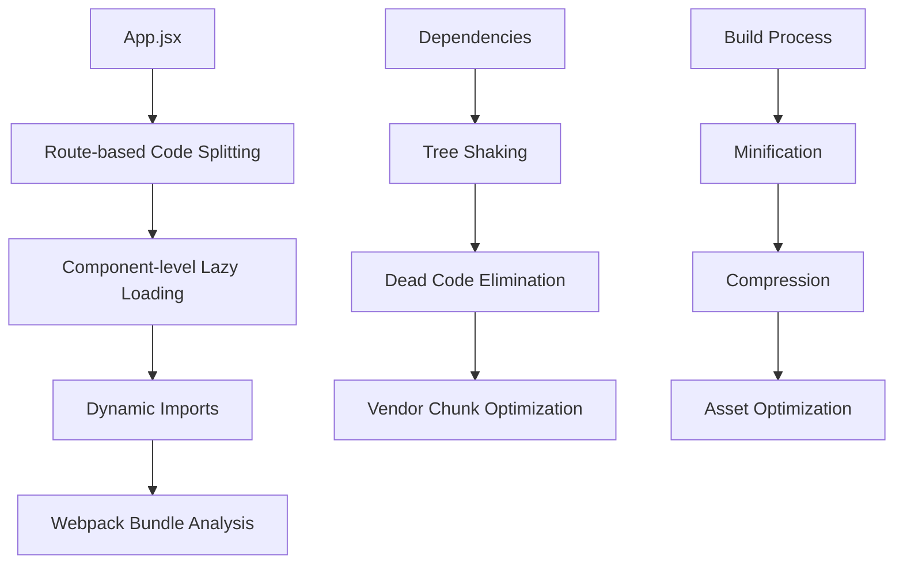
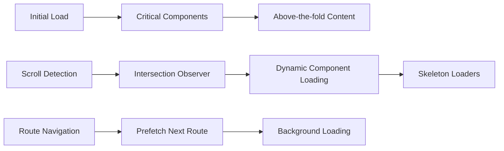
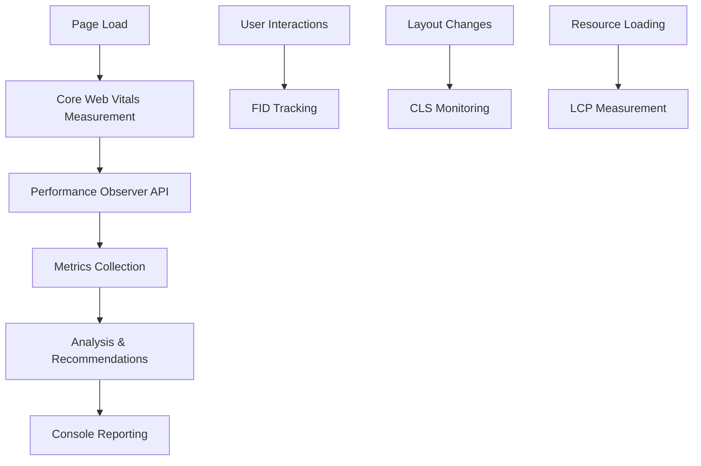

# Design Document - Portfolio Performance Optimization

## Overview

Este documento describe el diseño técnico para optimizar el rendimiento del portafolio de Alejandro Seclen Leonardo. La solución se enfoca en reducir significativamente los tiempos de carga, implementar lazy loading inteligente, optimizar assets, y mejorar las métricas de Core Web Vitals sin comprometer la experiencia visual y funcional existente.

### Current State Analysis

**Fortalezas identificadas:**
- Configuración básica de performance monitoring
- Headers de cache configurados en Netlify
- Uso de React 18 con características modernas
- Implementación de Error Boundary

**Oportunidades de mejora:**
- Bundle size grande debido a carga completa de todas las dependencias
- Falta de code splitting y lazy loading de componentes
- Animaciones complejas (ParticleBackground) que pueden afectar rendimiento
- Carga síncrona de todos los componentes en App.jsx
- Falta de optimización de imágenes y assets

## Architecture

### 1. Bundle Optimization Architecture



### 2. Lazy Loading Strategy



### 3. Performance Monitoring Flow



## Components and Interfaces

### 1. Enhanced Performance Utilities

**File: `src/utils/performanceOptimized.js`**

```javascript
// Core Web Vitals with enhanced reporting
interface WebVitalsMetrics {
  fcp: number;
  lcp: number;
  fid: number;
  cls: number;
  tti: number;
  tbt: number; // Total Blocking Time
}

// Bundle analysis interface
interface BundleAnalysis {
  totalSize: number;
  chunkSizes: ChunkInfo[];
  unusedCode: string[];
  recommendations: string[];
}

// Resource loading optimization
interface ResourceOptimization {
  preloadCritical(): void;
  lazyLoadImages(): void;
  optimizeWebFonts(): void;
  implementServiceWorker(): void;
}
```

### 2. Lazy Loading Components

**Component Wrapper: `src/components/LazyWrapper.jsx`**

```javascript
interface LazyWrapperProps {
  children: React.ReactNode;
  fallback?: React.ReactNode;
  rootMargin?: string;
  threshold?: number;
  onLoad?: () => void;
}
```

**Skeleton Loader: `src/components/SkeletonLoader.jsx`**

```javascript
interface SkeletonLoaderProps {
  type: 'text' | 'image' | 'card' | 'custom';
  lines?: number;
  height?: string;
  width?: string;
  className?: string;
}
```

### 3. Optimized Animation Components

**Enhanced Particle Background: `src/components/OptimizedParticleBackground.jsx`**

```javascript
interface ParticleConfig {
  maxParticles: number;
  animationSpeed: number;
  enableConnections: boolean;
  respectMotionPreference: boolean;
  performanceMode: 'high' | 'medium' | 'low';
}
```

### 4. Image Optimization Component

**Optimized Image: `src/components/OptimizedImage.jsx`**

```javascript
interface OptimizedImageProps {
  src: string;
  alt: string;
  webpSrc?: string;
  avifSrc?: string;
  placeholder?: string;
  sizes?: string;
  loading?: 'lazy' | 'eager';
  onLoad?: () => void;
  className?: string;
}
```

## Data Models

### 1. Performance Metrics Model

```javascript
class PerformanceMetrics {
  constructor() {
    this.vitals = new Map();
    this.resourceTimings = [];
    this.userTimings = [];
    this.navigationTiming = null;
  }
  
  recordVital(name, value) {
    this.vitals.set(name, {
      value,
      timestamp: performance.now(),
      rating: this.getRating(name, value)
    });
  }
  
  getRating(metric, value) {
    const thresholds = {
      fcp: { good: 1800, poor: 3000 },
      lcp: { good: 2500, poor: 4000 },
      fid: { good: 100, poor: 300 },
      cls: { good: 0.1, poor: 0.25 }
    };
    
    const threshold = thresholds[metric];
    if (!threshold) return 'unknown';
    
    if (value <= threshold.good) return 'good';
    if (value <= threshold.poor) return 'needs-improvement';
    return 'poor';
  }
}
```

### 2. Resource Loading Model

```javascript
class ResourceManager {
  constructor() {
    this.criticalResources = new Set();
    this.lazyResources = new Map();
    this.loadedResources = new Set();
    this.failedResources = new Set();
  }
  
  addCriticalResource(url, type) {
    this.criticalResources.add({ url, type, priority: 'high' });
  }
  
  addLazyResource(url, trigger) {
    this.lazyResources.set(url, { trigger, loaded: false });
  }
  
  preloadCritical() {
    this.criticalResources.forEach(resource => {
      this.preloadResource(resource.url, resource.type);
    });
  }
}
```

## Error Handling

### 1. Lazy Loading Error Handling

```javascript
// Retry mechanism for failed dynamic imports
const retryDynamicImport = async (importFn, retries = 3) => {
  try {
    return await importFn();
  } catch (error) {
    if (retries > 0) {
      console.warn(`Import failed, retrying... (${retries} attempts left)`);
      await new Promise(resolve => setTimeout(resolve, 1000));
      return retryDynamicImport(importFn, retries - 1);
    }
    throw error;
  }
};
```

### 2. Performance Monitoring Error Handling

```javascript
// Graceful degradation for unsupported APIs
const safePerformanceObserver = (callback, options) => {
  try {
    if ('PerformanceObserver' in window) {
      const observer = new PerformanceObserver(callback);
      observer.observe(options);
      return observer;
    }
  } catch (error) {
    console.warn('PerformanceObserver not supported:', error);
    return null;
  }
};
```

### 3. Resource Loading Error Handling

```javascript
// Fallback strategies for failed resources
const loadResourceWithFallback = async (primaryUrl, fallbackUrl) => {
  try {
    return await loadResource(primaryUrl);
  } catch (error) {
    console.warn(`Primary resource failed: ${primaryUrl}, trying fallback`);
    try {
      return await loadResource(fallbackUrl);
    } catch (fallbackError) {
      console.error('Both primary and fallback resources failed');
      throw fallbackError;
    }
  }
};
```

## Testing Strategy

### 1. Performance Testing

**Automated Performance Tests:**
- Lighthouse CI integration para métricas automatizadas
- Bundle size monitoring con alertas en CI/CD
- Core Web Vitals testing en diferentes dispositivos
- Memory leak detection tests

**Test Structure:**
```javascript
describe('Performance Optimization', () => {
  test('Bundle size should be under threshold', async () => {
    const bundleStats = await analyzeBundleSize();
    expect(bundleStats.totalSize).toBeLessThan(500 * 1024); // 500KB
  });
  
  test('Lazy loading should work correctly', async () => {
    const component = await loadComponentLazily('Projects');
    expect(component).toBeDefined();
  });
  
  test('Core Web Vitals should meet thresholds', async () => {
    const vitals = await measureWebVitals();
    expect(vitals.lcp).toBeLessThan(2500);
    expect(vitals.fid).toBeLessThan(100);
    expect(vitals.cls).toBeLessThan(0.1);
  });
});
```

### 2. Component Testing

**Lazy Loading Tests:**
```javascript
describe('LazyWrapper Component', () => {
  test('should show skeleton while loading', () => {
    render(<LazyWrapper fallback={<SkeletonLoader />}>
      <AsyncComponent />
    </LazyWrapper>);
    
    expect(screen.getByTestId('skeleton-loader')).toBeInTheDocument();
  });
  
  test('should load component when in viewport', async () => {
    const { container } = render(<LazyWrapper><AsyncComponent /></LazyWrapper>);
    
    // Simulate intersection
    mockIntersectionObserver.triggerIntersection(container.firstChild, true);
    
    await waitFor(() => {
      expect(screen.getByTestId('async-component')).toBeInTheDocument();
    });
  });
});
```

### 3. Integration Testing

**End-to-End Performance Tests:**
- Puppeteer tests para métricas reales de navegador
- Network throttling tests para conexiones lentas
- Device emulation tests para diferentes dispositivos
- User journey performance tracking

### 4. Monitoring and Alerting

**Production Monitoring:**
```javascript
// Real User Monitoring (RUM)
const setupRUM = () => {
  // Track real user metrics
  new PerformanceObserver((list) => {
    list.getEntries().forEach((entry) => {
      if (entry.entryType === 'largest-contentful-paint') {
        sendMetricToAnalytics('lcp', entry.startTime);
      }
    });
  }).observe({ entryTypes: ['largest-contentful-paint'] });
};
```

**Performance Budget Alerts:**
- Bundle size increase alerts
- Core Web Vitals degradation notifications
- Memory usage spike detection
- Failed resource loading alerts

## Implementation Phases

### Phase 1: Foundation (Bundle & Code Splitting)
- Implement dynamic imports for major components
- Set up bundle analysis and monitoring
- Configure webpack optimizations

### Phase 2: Lazy Loading (Components & Resources)
- Create LazyWrapper and SkeletonLoader components
- Implement Intersection Observer for component loading
- Optimize image loading with modern formats

### Phase 3: Performance Monitoring (Enhanced Metrics)
- Upgrade performance utilities with detailed reporting
- Implement Real User Monitoring
- Set up performance budgets and alerts

### Phase 4: Advanced Optimizations (Animations & Memory)
- Optimize ParticleBackground for performance
- Implement memory management strategies
- Add service worker for caching

Esta arquitectura proporciona una base sólida para optimizar significativamente el rendimiento del portafolio mientras mantiene toda la funcionalidad existente.