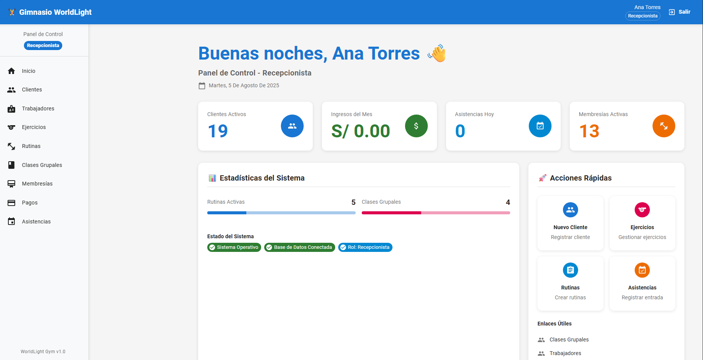

# Portafolio Personal

¡Bienvenido a mi portafolio!

Este proyecto es una aplicación web desarrollada con **React** y **Vite**. Aquí muestro mis proyectos, habilidades y experiencia como desarrollador frontend.

## 🚀 Demo en línea

[¡Ver el portafolio en línea!](https://portafoliozzz.netlify.app/)

## 📸 Captura de pantalla



## 🛠️ Tecnologías utilizadas
- React 19
- Vite 7
- Styled Components
- Framer Motion

## 📦 Instalación y uso local

1. Clona el repositorio:
   ```bash
   git clone https://github.com/Sekujk/Portafolio.git
   cd Portafolio
   ```
2. Instala las dependencias:
   ```bash
   npm install
   ```
3. Inicia el servidor de desarrollo:
   ```bash
   npm run dev
   ```
   El sitio estará disponible en `http://localhost:5173`.

## 🏗️ Build para producción

```bash
npm run build
```
El resultado estará en la carpeta `dist/`.

## ☁️ Deploy en Netlify

1. Ingresa a [Netlify](https://app.netlify.com/) y haz login.
2. Haz clic en "Add new site" > "Import an existing project".
3. Selecciona tu repositorio de GitHub.
4. Configura:
   - **Build command:** `npm run build`
   - **Publish directory:** `dist`
5. Haz clic en "Deploy site".

Cada vez que hagas push a GitHub, Netlify actualizará tu portafolio automáticamente.

## ✍️ Autor
- **Alejandro Seclen**
- [LinkedIn](https://www.linkedin.com/in/alejandroseclenl/)
- [Correo](mailto:alejoseclen@gmail.com)

---

### ¿Cómo agregar el `index.html` a git?

Si por alguna razón tu archivo `index.html` no está en el repositorio, puedes agregarlo así:

```bash
git add index.html
git commit -m "Agregar index.html"
git push
```

Así quedará versionado y subido a GitHub junto con el resto de tu proyecto.

---

¡Gracias por visitar mi portafolio! Si tienes feedback o propuestas, no dudes en contactarme.
